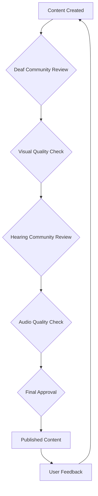

# Inclusive Design Guide for GSL Learning Platform

## Philosophy

Inclusive design means creating learning experiences that work for the widest range of people, regardless of their abilities, backgrounds, or circumstances. For the GSL Learning Platform, this means designing for both deaf/hard-of-hearing signers and hearing learners who want to learn sign language.

## Understanding Our Learners

### Deaf and Hard-of-Hearing Learners

**Characteristics:**
- Visual learners by necessity and preference
- May have Sign Language as their first or primary language
- Experienced in visual communication strategies
- Often prefer direct, visual information
- May find text-heavy interfaces challenging if English is a second language

**Design Needs:**
- Clear, unobstructed video demonstrations
- Detailed visual descriptions
- No dependency on audio cues
- Visual feedback for all interactions
- High-contrast, easy-to-scan layouts
- Minimal text when possible, maximized visual content

### Hearing Learners

**Characteristics:**
- Often audio-visual learners
- Sign language is typically a second or third language
- May benefit from verbal explanations
- Comfortable with traditional educational formats
- May find purely visual learning challenging initially

**Design Needs:**
- Voice narration and audio guides
- Verbal mnemonics and memory aids
- Spoken pacing and rhythm cues
- Audio feedback options
- Multi-modal reinforcement (audio + visual)

## Dual-Mode Design Patterns

### Pattern 1: Visual Descriptions

**Visual Mode (Deaf):**
```markdown
### Letter A
- **Hand Shape**: Closed fist
- **Thumb Position**: Along the side
- **Palm Faces**: Away from body
- **Visual Cue**: Like holding an invisible ball
```

**Audio + Visual Mode (Hearing):**
```markdown
### Letter A
*[Listen to the audio guide]*
- **Hand Shape**: Make a closed fist
- **Thumb Position**: Rest your thumb along the side
- **Palm Faces**: Turn your palm away from your body
- **Say Aloud**: "A for Apple" as you make the sign
```

### Pattern 2: Practice Instructions

**Visual Mode:**
```markdown
## Practice Steps
1. Watch video demonstration (replay 3-5 times)
2. Practice in front of a mirror
3. Take photos from different angles
4. Compare your photos with the video stills
5. Adjust hand position as needed
```

**Audio + Visual Mode:**
```markdown
## Practice Steps
1. Play the video with narration
2. Say the letter out loud as you sign
3. Record yourself on video
4. Play back and listen to your verbal cues
5. Adjust timing to match the audio guide
```

### Pattern 3: Quiz Feedback

**Visual Mode:**
```tsx
// Correct answer
<div className="flex items-center gap-2 p-4 bg-success/10 border-l-4 border-success">
  <CheckCircle className="h-6 w-6 text-success" />
  <span className="font-medium text-success">Correct!</span>
</div>

// Incorrect answer
<div className="flex items-center gap-2 p-4 bg-error/10 border-l-4 border-error">
  <XCircle className="h-6 w-6 text-error" />
  <span className="font-medium text-error">Not quite. Try again.</span>
</div>
```

**Audio + Visual Mode:**
```tsx
// Add audio feedback
const playSound = (type: 'correct' | 'incorrect') => {
  const audio = new Audio(type === 'correct' ? '/sounds/correct.mp3' : '/sounds/incorrect.mp3');
  audio.play();
};

// Same visual feedback + audio
<div onClick={() => playSound('correct')}>
  {/* Visual feedback components */}
</div>
```

## Collaboration Between Communities

### Content Creation

**Best Practice: Involve Both Communities**

1. **Deaf Content Creators** should:
   - Lead on sign accuracy and authenticity
   - Verify visual clarity of demonstrations
   - Review visual-mode content for effectiveness
   - Provide cultural context and nuances

2. **Hearing Content Creators** should:
   - Create audio narration scripts
   - Develop verbal mnemonics
   - Review audio-mode content for clarity
   - Ensure accessibility for hearing learners

3. **Collaborative Review:**
   - Both groups review all content
   - Cross-mode testing ensures quality
   - Feedback loops improve both versions
   - Cultural sensitivity is maintained

### Community Feedback Loop



**Implementation:**
- Feedback forms in both modes
- Visual and written feedback options
- Video feedback submissions
- Community forums for discussion
- Regular content improvement cycles

## UI/UX Principles for Inclusive Design

### 1. Multi-Modal Feedback

Provide feedback through multiple channels:

```tsx
const showFeedback = (message: string, type: 'success' | 'error') => {
  // Visual
  toast({
    title: type === 'success' ? '✓ Success' : '✗ Error',
    description: message,
    variant: type === 'success' ? 'default' : 'destructive'
  });
  
  // Audio (if in hearing mode and enabled)
  if (mode === 'hearing' && audioEnabled) {
    playSound(type);
  }
  
  // Haptic (if supported)
  if ('vibrate' in navigator) {
    navigator.vibrate(type === 'success' ? 100 : [100, 50, 100]);
  }
};
```

### 2. Flexible Content Consumption

Allow users to consume content their way:

```tsx
<div className="lesson-controls">
  {/* Video playback speed */}
  <Select value={playbackSpeed} onValueChange={setPlaybackSpeed}>
    <SelectOption value="0.5">0.5x</SelectOption>
    <SelectOption value="1">Normal</SelectOption>
    <SelectOption value="1.5">1.5x</SelectOption>
  </Select>
  
  {/* Caption toggle */}
  <Button
    variant="outline"
    onClick={() => setCaptionsEnabled(!captionsEnabled)}
  >
    {captionsEnabled ? 'Hide' : 'Show'} Captions
  </Button>
  
  {/* Audio toggle (hearing mode) */}
  {mode === 'hearing' && (
    <Button
      variant="outline"
      onClick={() => setAudioEnabled(!audioEnabled)}
    >
      {audioEnabled ? <Volume2 /> : <VolumeX />}
    </Button>
  )}
</div>
```

### 3. Progressive Disclosure

Don't overwhelm with information:

```tsx
// Start simple
<LessonIntro>
  <h1>{lesson.title}</h1>
  <p>{lesson.description}</p>
</LessonIntro>

// Expand on demand
<Collapsible>
  <CollapsibleTrigger>
    View Detailed Objectives
  </CollapsibleTrigger>
  <CollapsibleContent>
    <ul>
      {lesson.objectives.map(obj => (
        <li key={obj}>{obj}</li>
      ))}
    </ul>
  </CollapsibleContent>
</Collapsible>
```

### 4. Clear Information Architecture

Organize content logically for both modes:

```
Lesson Structure:
├── 1. Introduction
│   ├── Title & Description
│   └── Learning Objectives
├── 2. Video Demonstration
│   ├── Main Video (mode-specific)
│   ├── Playback Controls
│   └── Caption/Audio Controls
├── 3. Detailed Notes
│   ├── Visual Descriptions (mode-specific)
│   └── Practice Tips (mode-specific)
├── 4. Quiz
│   └── 5 Questions (mode-specific)
└── 5. Exercises
    └── Practice Activities (mode-specific)
```

## Testing with Both Communities

### Deaf/Hard-of-Hearing Testing

**Test Scenarios:**
- [ ] Complete entire lesson with audio OFF
- [ ] Use only visual information
- [ ] Navigate with keyboard only
- [ ] Test with high contrast mode
- [ ] Verify all videos are clear and unobstructed
- [ ] Check that no information requires audio

**Feedback Questions:**
- Is the visual content clear and sufficient?
- Are hand positions easy to see and understand?
- Is text easy to read and understand?
- Are visual cues helpful?
- Would you recommend this to other deaf learners?

### Hearing Learner Testing

**Test Scenarios:**
- [ ] Complete lesson with audio ON
- [ ] Use audio + visual together
- [ ] Test audio narration timing
- [ ] Verify spoken cues are helpful
- [ ] Check audio-visual synchronization
- [ ] Ensure visual content is still strong

**Feedback Questions:**
- Is the audio narration helpful?
- Are verbal cues effective?
- Does audio enhance or distract?
- Is pacing appropriate?
- Would you use this to learn sign language?

### Cross-Mode Testing

**Test Scenarios:**
- [ ] Switch modes mid-lesson
- [ ] Compare content between modes
- [ ] Verify both modes teach effectively
- [ ] Check for consistency in learning outcomes
- [ ] Test mode preferences save correctly

## Cultural Sensitivity Guidelines

### Deaf Culture Respect

**DO:**
- ✅ Prioritize visual-first design
- ✅ Involve deaf signers in content creation
- ✅ Use proper sign language terminology
- ✅ Respect Deaf culture and identity
- ✅ Present deaf individuals as experts, not patients
- ✅ Avoid "fixing" or "curing" language

**DON'T:**
- ❌ Treat deafness as a disability to overcome
- ❌ Assume all deaf people want to hear
- ❌ Use infantilizing language
- ❌ Create audio-dependent content in "deaf mode"
- ❌ Appropriate deaf culture without involvement

### Inclusive Language

**Preferred Terms:**
- "Deaf" or "deaf/hard-of-hearing" (not "hearing impaired")
- "Deaf person" or "person who is deaf" (person-first or identity-first based on preference)
- "Sign language user" or "signer"
- "Visual learner" (not "disabled learner")

**Context Matters:**
- Ask individuals their preferred terminology
- Respect identity-first vs person-first preferences
- Use community-accepted terms
- Avoid medical model language

## Accessibility Beyond Deaf/Hearing

### Other Considerations

**Visual Impairments:**
- High contrast modes
- Screen reader compatibility
- Keyboard navigation
- Text resizing support

**Motor Disabilities:**
- Large click targets
- Keyboard alternatives
- Voice control support (hearing mode)
- Generous timing allowances

**Cognitive Disabilities:**
- Clear, simple language
- Consistent layouts
- Progress indicators
- Error prevention and recovery

**Temporary Disabilities:**
- One-handed mode
- Bright environment adjustments
- Noisy environment options
- Low-bandwidth support

## Measuring Inclusive Success

### Key Metrics

1. **Mode Usage**
   - % users in each mode
   - Mode switching frequency
   - Mode preference patterns

2. **Completion Rates**
   - Compare across modes
   - Identify drop-off points
   - Measure satisfaction scores

3. **Community Feedback**
   - Deaf community ratings
   - Hearing learner ratings
   - Feature requests by mode
   - Cultural sensitivity feedback

4. **Accessibility Scores**
   - WCAG compliance level
   - Lighthouse accessibility score
   - Screen reader compatibility
   - Keyboard navigation coverage

### Success Criteria

**Visual Mode Success:**
- ✅ 100% of content accessible without audio
- ✅ High satisfaction from deaf testers
- ✅ Clear visual demonstrations
- ✅ Effective learning outcomes

**Audio + Visual Mode Success:**
- ✅ Audio enhances without replacing visuals
- ✅ High satisfaction from hearing learners
- ✅ Effective verbal cues
- ✅ Comparable learning outcomes to visual mode

**Overall Platform Success:**
- ✅ Both communities feel represented
- ✅ Content created with community input
- ✅ Regular feedback incorporated
- ✅ Continuous improvement based on user needs

## Resources for Inclusive Design

### General Resources
- [Inclusive Design Principles](https://inclusivedesignprinciples.org/)
- [Microsoft Inclusive Design Toolkit](https://www.microsoft.com/design/inclusive/)
- [W3C Accessibility Guidelines](https://www.w3.org/WAI/)

### Deaf Culture Resources
- National Association of the Deaf (NAD)
- World Federation of the Deaf (WFD)
- Deaf Culture learning resources
- Sign Language linguistics research

### Testing Tools
- WAVE accessibility checker
- axe DevTools
- Screen reader testing
- Contrast checkers
- User testing platforms

## Getting Involved

### Content Creators
- Join content creation team
- Submit video demonstrations
- Review existing content
- Provide cultural context

### Community Reviewers
- Test new features
- Provide feedback
- Suggest improvements
- Help with translations

### Developers
- Implement accessibility features
- Fix reported issues
- Propose new inclusive features
- Document best practices

---

**Remember:** Inclusive design is an ongoing process, not a one-time achievement. Regular testing, feedback, and improvement cycles with both communities ensure the platform continues to serve all learners effectively.
